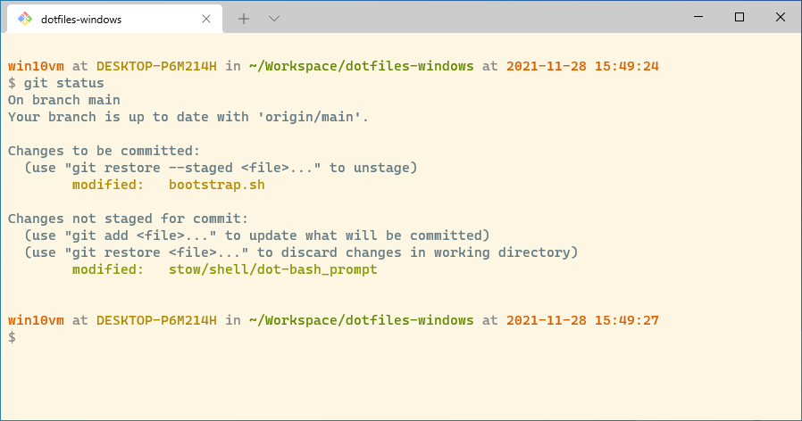

# Okeanos’ dotfiles



This is a Windows port of [my dotfiles](https://github.com/Okeanos/dotfiles) for macOS.

## Installation

**Warning:** If you want to give these dotfiles a try, you should first fork this repository, review the code, and
remove things you don’t want or need. Don’t blindly use my settings unless you know what that entails. Use at your own
risk!

**Warning:** [Docker Desktop](https://www.docker.com) is installed as part of the setup. Because
it [defaults to the WSL 2 backend](https://docs.docker.com/desktop/install/windows-install/) you have to make sure to
install that before everything else.

### Docker & Windows Subsystem for Linux (WSL 2)

You have to manually install the [Windows Subsystem for Linux](https://docs.microsoft.com/en-us/windows/wsl/install)
(WSL 2) because it requires a restart of the system and some manual intervention.

**Note**: Enabling WSL 2 means that software such as [VirtualBox](https://www.virtualbox.org)
or [VMWare Workstation](https://www.vmware.com/products/workstation-pro.html) no longer works as expected. Windows only
allows a single hypervisor at a time and WSL 2 is Hyper-V based and prevents running VirtualBox/VMWare Workstation.
Workarounds for [VirtualBox](https://www.virtualbox.org/manual/UserManual.html#hyperv-support) and [VMWare](https://blogs.vmware.com/workstation/2020/05/vmware-workstation-now-supports-hyper-v-mode.html)
exist, however, may suffer from [extreme](https://communities.vmware.com/t5/VMware-Workstation-Pro/Huge-performance-drop-after-upgrading-to-VMware-Workstation-Pro/td-p/2888831)
[performance](https://communities.vmware.com/t5/VMware-Workstation-Player/Huge-performance-drop-of-VMWare-Player-guest-running-on-Windows/td-p/2808460)
[penalties](https://www.virtualbox.org/manual/UserManual.html#hyperv-support).

If you want a custom WSL 2 instance (different from the Docker backend) check the available distributions and install
one:

```powershell
wsl --list --online
wsl --install --distribution Ubuntu-22.04
```

### Getting Started

Before you begin have a look at the [code signing](code-signing.md) instructions.

1. Manually download [`winget.ps1`](https://raw.githubusercontent.com/Okeanos/dotfiles-windows/main/winget.ps1) and all
  other `winget_*` files into the same location
2. Update the `winget.ps1` to only install software you actually want and sign it
3. Go through the `winget_*` files and modify them as necessary because they will be used to source the installation
  options for e.g. Git to allow unattended installation.
4. Execute `winget.ps1` from your PowerShell (needs elevated/administrator permissions)
5. You can now clone the repository wherever you want (I like to keep it in `%UserProfile%\Workspace\dotfiles`)
6. You can now `bootstrap.ps1` your system (needs elevated/administrator permissions) after signing it
7. **Optionally** and **after a careful review** you can now run `windows.ps1` (needs elevated/administrator
  permissions and signing obviously)

If you decide not to run the `windows.ps1` script please make sure to set the following `User Environment Variables` in
Windows:

- `HOME` : `%UserProfile%`
  - this will prevent Git Bash supplied tools from arbitrarily deciding on their own where `~`, i.e. `${HOME}` is
- `USER` : "your username"
  - this will prevent Git Bash supplied tools (such as SSH) from arbitrarily deciding on their own what to call you

#### Installing Software (`winget.ps1`)

When setting up a new PC, you need to install some common [Windows Packages](https://github.com/microsoft/winget-cli)
(after making sure that `winget` is installed, of course) for this repository to work as expected:

```powershell
.\winget.ps1
```

Some functionality of these dotfiles depends on packages installed by `winget.ps1`. If you don’t plan to use `winget`,
you should look carefully through the `winget.ps1` and related config files and manually install any particularly
important tools manually. Good examples of these are Windows Terminal and Git Bash.

##### Lightweight Editor

The aforementioned `winget.ps1` includes [Visual Studio Code](https://code.visualstudio.com) ("VSCode"), i.e. the
non-free, proprietary Microsoft product that includes telemetry etc., as a lightweight GUI editor. Either disable
telemetry manually if you are bothered by it (e.g. as described in [this gist](https://gist.github.com/hyperupcall/99e355405611be6c4e0a38b6e3e8aad0))
or switch to another editor, e.g.:

- [VSCodium](https://vscodium.com)
- [NotePad++](https://notepad-plus-plus.org)
- [Sublime Text](https://www.sublimetext.com)
- …

##### Manual Installation Caveats

If you do not want to run the `winget.ps1` script follow the installation instructions for the following software and
take note of the caveats below:

- [Windows Subsystem for Linux (WSL 2)](https://docs.microsoft.com/en-us/windows/wsl/install)
- [Windows Terminal](https://github.com/microsoft/terminal)
- [Git Bash](https://git-scm.com)
  - **Select Components**
    - Uncheck the box for the Windows Explorer Integration (it doesn't work with Windows Terminal integration)
    - Check the box for the Windows Terminal Fragment
  - When prompted use the Windows Secure Channel library instead of the bundled certficates (allows using the Windows
    certificate store for system-wide same behavior when it comes to self-signed certificates)
  - When prompted select "checkout as-is, commit as-is" (less magic and tools can be correctly configured to use Unix
    style line endings nowadays)
- A password manager, either:
  - [KeePass](https://keepass.info)
    - [KeeAgent](https://github.com/dlech/KeeAgent) for SSH support (supports Windows native OpenSSH & Git Bash bundled
      OpenSSH in parallel)
  - [KeePassXC](https://keepass.info) (built in SSH Agent Support, different from KeeAgent; only supports Windows native
    OpenSSH)
    - [Chrome/Chromium Extension](https://chrome.google.com/webstore/detail/keepassxc-browser/oboonakemofpalcgghocfoadofidjkkk)
    - [Firefox Extension](https://addons.mozilla.org/en-US/firefox/addon/keepassxc-browser/)
  - [1Password](https://1password.com)
    - [SSH Agent Setup](https://developer.1password.com/docs/ssh/agent/)

Once you installed all of this and configured the software to your liking you can now clone the repository wherever you
want (I like to keep it in `%UserProfile%/Workspace/dotfiles`). After that you can run the bootstrapper from your
PowerShell as described below.

### The bootstrap script (`bootstrap.ps1`)

The bootstrapper script will pull in the latest version and copy the files to your home folder. Run it from your
Powershell.

```powershell
cd "$( $ENV:UserProfile )\Workspace\dotfiles"; .\bootstrap.ps1
```

To update, `cd` into your local `dotfiles` repository and then run bootstrapper again:

```powershell
cd "$( $ENV:UserProfile )\Workspace\dotfiles"; .\bootstrap.ps1
```

#### Java Installation

The [Maven Toolchains](https://maven.apache.org/guides/mini/guide-using-toolchains.html) file assumes that the [Adoptium](https://adoptium.net)
Java versions are used. Additionally, the target folder has to be modified during the installation to remove any patch
and minor version information, i.e.:

`C:\Program Files\Eclipse Adoptium\jdk-17.0.1.12-hotspot` becomes `C:\Program Files\Eclipse Adoptium\temurin-17.jdk` (in
line with macOS and Linux naming schemes)

This has to be done explicitly (see [adoptium/installer#422](https://github.com/adoptium/installer/issues/422) for
details) but can be automated as shown in `winget.ps1`.

#### Sensible Windows defaults (`windows.ps1`)

When setting up a new PC, you may want to set some sensible Windows defaults. Please note that you really ought to read
the contents of the `windows.ps1` script very, very carefully because it changes a large number of system settings. You
can apply it by invoking it like this:

```powershell
cd "$( $ENV:UserProfile )\Workspace\dotfiles"; .\windows.ps1
```

## Modifying the `$PATH`

Please note that the standard dotfiles already modify your Git Bash path in two ways:

- They add `/c/Windows/System32/OpenSSH` to force all programs to use the Windows supplied version of OpenSSH (to make
  it compatible with KeePassXC by default)
- They add `$HOME/bin` as a place where you can put binaries such as [`jq`](https://github.com/stedolan/jq) to make them
  easily accessible

If `~/.path` exists, it will be sourced along with the other files, before any feature testing (such as
[detecting which version of `ls` is being used](https://github.com/mathiasbynens/dotfiles/blob/aff769fd75225d8f2e481185a71d5e05b76002dc/.aliases#L21-L26))
takes place.

Here’s an example `~/.path` file that adds `/usr/local/bin` to the `$PATH`:

```bash
export PATH="/usr/local/bin:$PATH"
```

## Add custom commands without creating a new fork

If `~/.extra` exists, it will be sourced along with the other files. You can use this to add a few custom commands
without the need to fork this entire repository, or to add commands you don’t want to commit to a public repository.

An example of `~/.extra` by the original author of this repository looks something like this:

```bash
# Git credentials
# Not in the repository, to prevent people from accidentally committing under my name
GIT_AUTHOR_NAME="Foo Bar"
GIT_COMMITTER_NAME="$GIT_AUTHOR_NAME"
git config --global user.name "$GIT_AUTHOR_NAME"
GIT_AUTHOR_EMAIL="foo.bar@example.org"
GIT_COMMITTER_EMAIL="$GIT_AUTHOR_EMAIL"
git config --global user.email "$GIT_AUTHOR_EMAIL"
```

You could also use `~/.extra` to override settings, functions and aliases from my dotfiles repository. It’s probably
better to [fork this repository](https://github.com/Okeanos/dotfiles/fork) instead, though.

## Unlinking / Uninstalling

If you want to unlink (uninstall) all dotfiles managed by this repository you can use the `unlink.sh` script. This
operation is non-destructive and will only remove the symlinks from your `%UserProfile%` directory. Any customizations,
e.g. `.extra` or `.gituser`, that were created by you will stay in `%UserProfile%`. You can restore the dotfiles again
by running `bootstrap.ps1`.

```powershell
cd "$( $ENV:UserProfile )\Workspace\dotfiles"; .\unlink.ps1
```

If you want to unlink particular dotfiles (e.g. for `vim`) you'll have to manually delete the files from
your `%UserProfile%` directory because there is no [`stow`](https://www.gnu.org/software/stow/) for Windows 😕.

## SSH Setup

Please read [SSH Setup](./ssh-setup.md) for details and options concerning SSH on Windows including SSH Agent options.

## Thanks to…

- [Mathias Bynens](https://mathiasbynens.be) and whose [dotfiles](https://github.com/mathiasbynens/dotfiles) these are
  largely derived from
- [Tim Schneider](https://github.com/timschneiderxyz) and his [dotfiles](https://github.com/timschneiderxyz/dotfiles)
  and [fyWin](https://github.com/timschneiderxyz/fyWin) scripts
- [Rohan Cragg](https://rohancragg.co.uk) and his [Bash Shell on Windows](https://rohancragg.co.uk/misc/git-bash/) guide
- [Maarten Billemont's Bash Guide](http://mywiki.wooledge.org/BashGuide)
- [Mateusz Łoskot](http://mateusz.loskot.net) and his [wsl-config](https://github.com/mloskot/wsl-config)
- [June Castillote](https://adamtheautomator.com/how-to-sign-powershell-script/) for providing additional insights into
  PowerShell script signing
