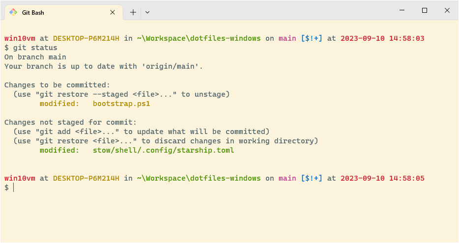

# Okeanos’ dotfiles



## Installation

Set the following `User Environment Variables` in Windows:

- `HOME` : `%UserProfile%` (this will prevent Git Bash supplied tools from arbitrarily deciding on their own where `~/`, i.e. `${HOME}` is)

Follow the installation instructions for:

- [Windows Terminal](https://github.com/microsoft/terminal)
- [Git Bash](https://git-scm.com)
  - **Select Components**
    - Uncheck the box for the Windows Explorer Integration
    - Check the box for the Windows Terminal Fragment
  - When prompted, select externally supplied SSH
  - When prompted use the Windows Secure Channel library instead of the bundled certficates
	- When prompted select "checkout as-is, commit as-is"
- [KeePassXC](https://keepass.info)
  - [Chrome/Chromium Extension](https://chrome.google.com/webstore/detail/keepassxc-browser/oboonakemofpalcgghocfoadofidjkkk)
  - [Firefox Extension](https://addons.mozilla.org/en-US/firefox/addon/keepassxc-browser/)

Once you installed all of this and configured the software to your liking you can now clone the repository wherever you want (I like to keep it in `%UserProfile%/Workspace/dotfiles`). Afterwards you can run the bootstrapper from your Git Bash as described below.

### KeePassXC as SSH Agent
The Windows enabled OpenSSH client makes using [KeePassXC](https://keepassxc.org) as an SSH agent to manage SSH keys on Windows within the Git Bash possible.
Enable the OpenSSH Agent via the Windows Services management interface by setting the `OpenSSH Authentication Agent` to `automatic` and starting it.

Within KeePassXC the SSH support has to be enabled in the KeePassXC settings along with the option to use OpenSSH instead of Pageant.

### The bootstrap script (`bootstrap.sh`)

The bootstrapper script will pull in the latest version and copy the files to your home folder. Run it from your Git Bash.

```bash
cd ~/Workspace/dotfiles && ./bootstrap.sh
```

To update, `cd` into your local `dotfiles` repository and then run bootstrapper again:

```bash
cd ~/Workspace/dotfiles && ./bootstrap.sh
```

#### Java Installation

The [Maven Toolchains](https://maven.apache.org/guides/mini/guide-using-toolchains.html) file assumes that the [Adoptium](https://adoptium.net) Java versions are used. Additionally, the target folder has to be modified during the installation to remove any patch and minor version information, i.e.:

`C:\Program Files\Eclipse Adoptium\jdk-17.0.1.12-hotspot` becomes `C:\Program Files\Eclipse Adoptium\jdk-17-hotspot`

This has to be done manually; see [adoptium/installer#422](https://github.com/adoptium/installer/issues/422) for details.

## Modifying the `$PATH`

If `~/.path` exists, it will be sourced along with the other files, before any feature testing (such as [detecting which version of `ls` is being used](https://github.com/mathiasbynens/dotfiles/blob/aff769fd75225d8f2e481185a71d5e05b76002dc/.aliases#L21-L26)) takes place.

Here’s an example `~/.path` file that adds `/usr/local/bin` to the `$PATH`:

```bash
export PATH="/usr/local/bin:$PATH"
```

## Add custom commands without creating a new fork

If `~/.extra` exists, it will be sourced along with the other files. You can use this to add a few custom commands without the need to fork this entire repository, or to add commands you don’t want to commit to a public repository.

An example of `~/.extra` by the original author of this repository looks something like this:

```bash
# Git credentials
# Not in the repository, to prevent people from accidentally committing under my name
GIT_AUTHOR_NAME="Mathias Bynens"
GIT_COMMITTER_NAME="$GIT_AUTHOR_NAME"
git config --global user.name "$GIT_AUTHOR_NAME"
GIT_AUTHOR_EMAIL="mathias@mailinator.com"
GIT_COMMITTER_EMAIL="$GIT_AUTHOR_EMAIL"
git config --global user.email "$GIT_AUTHOR_EMAIL"
```

You could also use `~/.extra` to override settings, functions and aliases from my dotfiles repository. It’s probably better to [fork this repository](https://github.com/Okeanos/dotfiles/fork) instead, though.

## Original Author

| [](http://twitter.com/mathias "Follow @mathias on Twitter") |
|---|
| [Mathias Bynens](https://mathiasbynens.be/) |

## Thanks to…

* @ptb and [his _macOS Setup_ repository](https://github.com/ptb/mac-setup)
* [Ben Alman](http://benalman.com/) and his [dotfiles repository](https://github.com/cowboy/dotfiles)
* [Cătălin Mariș](https://github.com/alrra) and his [dotfiles repository](https://github.com/alrra/dotfiles)
* [Gianni Chiappetta](https://butt.zone/) for sharing his [amazing collection of dotfiles](https://github.com/gf3/dotfiles)
* [Jan Moesen](http://jan.moesen.nu/) and his [ancient `.bash_profile`](https://gist.github.com/1156154) + [shiny _tilde_ repository](https://github.com/janmoesen/tilde)
* Lauri ‘Lri’ Ranta for sharing [loads of hidden preferences](https://web.archive.org/web/20161104144204/http://osxnotes.net/defaults.html)
* [Matijs Brinkhuis](https://matijs.brinkhu.is/) and his [dotfiles repository](https://github.com/matijs/dotfiles)
* [Nicolas Gallagher](http://nicolasgallagher.com/) and his [dotfiles repository](https://github.com/necolas/dotfiles)
* [Sindre Sorhus](https://sindresorhus.com/)
* [Tom Ryder](https://sanctum.geek.nz/) and his [dotfiles repository](https://sanctum.geek.nz/cgit/dotfiles.git/about)
* [Kevin Suttle](http://kevinsuttle.com/) and his [dotfiles repository](https://github.com/kevinSuttle/dotfiles) and [macOS-Defaults project](https://github.com/kevinSuttle/macOS-Defaults), which aims to provide better documentation for [`~/.macos`](https://mths.be/macos)
* [Haralan Dobrev](https://hkdobrev.com/)
* [Marcel Bischoff](https://herrbischoff.com) and his [Awesome macOS Command Line](https://git.herrbischoff.com/awesome-macos-command-line/about/)
* Anyone who [contributed a patch](https://github.com/mathiasbynens/dotfiles/contributors) or [made a helpful suggestion](https://github.com/mathiasbynens/dotfiles/issues)
